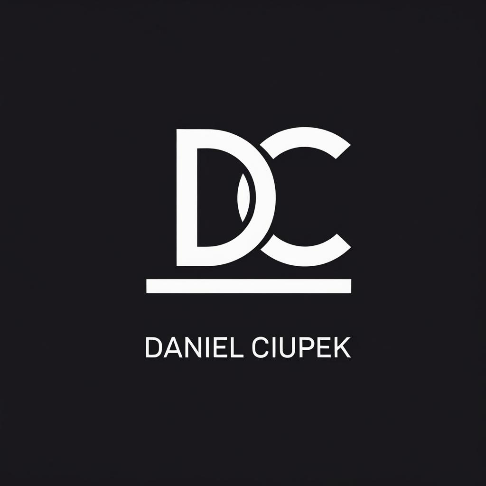

<p align="center">
  
</p>

<h1 align="center">Daniel Ciupek — Portfolio</h1>

<p align="center">
  Interaktywne portfolio / CV online Full Stack Developera
</p>

<p align="center">
  
  
  
  
  
</p>

<p align="center">
  <a href="#">🌐 Live Demo</a> · <a href="#uruchomienie-lokalne">📦 Instalacja</a> · <a href="#konfiguracja-treści">⚙️ Konfiguracja</a>
</p>

---

## O projekcie

Portfolio zbudowane w Next.js 15 z naciskiem na efekty wizualne i płynne animacje. Zawiera sekcje: Hero, O mnie, Tech Stack, Projekty, Certyfikaty, Kontakt oraz wersję ATS-friendly do druku pod adresem `/cv-print`.

## Stos technologiczny

| Warstwa | Technologia |
|---------|-------------|
| Framework | Next.js 15 (App Router) |
| Język | TypeScript (strict) |
| Stylowanie | Tailwind CSS v4 |
| Animacje | Framer Motion + GSAP ScrollTrigger |
| Smooth scroll | Lenis |
| Ikony | Lucide React + React Icons |

## Uruchomienie lokalne

```bash
# 1. Sklonuj repozytorium
git clone https://github.com/daniel-ciupek/CV_daniel_ciupek.git
cd CV_daniel_ciupek

# 2. Zainstaluj zależności
npm install

# 3. Uruchom serwer deweloperski
npm run dev
```

Otwórz [http://localhost:3000](http://localhost:3000) w przeglądarce.

> **Wersja CV do druku / PDF:** [http://localhost:3000/cv-print](http://localhost:3000/cv-print)  
> Użyj `Ctrl+P` → "Zapisz jako PDF" aby wygenerować plik.

## Konfiguracja treści

Wszystkie dane (imię, bio, projekty, certyfikaty, umiejętności, linki social) znajdują się w jednym pliku:

```
src/config/data.ts
```

Edytuj tylko ten plik — wszystkie sekcje strony i cv-print zaktualizują się automatycznie.

## Struktura projektu

```
src/
├── app/
│   ├── page.tsx          # Strona główna
│   ├── cv-print/         # Wersja ATS/PDF
│   └── globals.css       # Style globalne + klasy cv-*
├── components/
│   ├── features/         # Sekcje portfolio (Hero, About, ...)
│   ├── layout/           # Navbar, Footer
│   └── ui/               # Komponenty atomowe
├── config/
│   └── data.ts           # ← jedyne źródło prawdy
├── hooks/                # Custom hooks
└── types/                # Interfejsy TypeScript
```

## Deploy na Vercel

1. Połącz repozytorium z [Vercel](https://vercel.com)
2. Ustaw zmienną środowiskową w panelu Vercel:

```
NEXT_PUBLIC_SITE_URL=https://twoja-domena.pl
```

> Bez tej zmiennej Open Graph (podgląd przy udostępnianiu linku) nie będzie działać poprawnie.

---

<p align="center">
  Built with Next.js &amp; Framer Motion · © 2026 Daniel Ciupek
</p>
